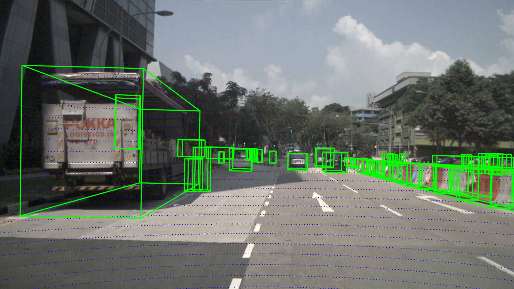

# nuscenes_frame_io

A utility library for working with nuScenes dataset frames, providing easy access to LiDAR, camera, and annotation data with proper coordinate transformations.

## Installation

```bash
pip install -e .
```

## Usage

```python
from nuscenes.nuscenes import NuScenes
from nuscenes_frame_io.frame_io import get_frame

nusc = NuScenes(version="v1.0-mini", dataroot="/path/to/nuScenes")
sample_token = nusc.sample[0]["token"]
frame = get_frame(nusc, sample_token)

# Access LiDAR data
lidar_path = frame["lidar"]["path"]
T_global_from_lidar = frame["lidar"]["T_global_from_sensor"]

# Access camera data
cam = frame["cameras"]["CAM_FRONT"]
K = cam["K"]  # intrinsic matrix
T_global_from_cam = cam["T_global_from_sensor"]

# Access annotations
for ann in frame["anns"]:
    print(ann["category_name"], ann["translation"])
```

## Coordinate Frames

**Ego frame** (vehicle center):
- `+x` forward
- `+y` left
- `+z` up

**Transformation chain**: `sensor -> ego -> global`
```
T_global_from_sensor = T_global_from_ego @ T_ego_from_sensor
```

## Available Data

**LiDAR**: `LIDAR_TOP`

**Cameras**:
- `CAM_FRONT`
- `CAM_FRONT_LEFT`
- `CAM_FRONT_RIGHT`
- `CAM_BACK`
- `CAM_BACK_LEFT`
- `CAM_BACK_RIGHT`

## Frame Structure

```python
frame = {
    "lidar": {
        "token": str,
        "path": str,
        "T_ego_from_sensor": np.ndarray,  # 4x4
        "T_global_from_sensor": np.ndarray,  # 4x4
    },
    "cameras": {
        "CAM_FRONT": {
            "token": str,
            "path": str,
            "K": np.ndarray,  # 3x3 intrinsic
            "T_ego_from_sensor": np.ndarray,
            "T_global_from_sensor": np.ndarray,
        },
        # ... other cameras
    },
    "anns": [
        {
            "token": str,
            "category_name": str,
            "translation": list,
            "size": list,
            "rotation": list,
            # ...
        }
    ]
}
```

## Examples

### LiDAR to Camera Projection with GT 3D Boxes



### LiDAR Top-Down View


<!--
NOTES:

ego frame -> Origin: center of the vehicle
+x  forward
+y  left
+z  up

so all data in this format to go global: sensor -> ego -> global
T_global_from_sensor = T_global_from_ego @ T_ego_from_sensor

for data:
1 lidar

6 cams:
CAM_FRONT
CAM_FRONT_LEFT
CAM_FRONT_RIGHT
CAM_BACK
CAM_BACK_LEFT
CAM_BACK_RIGHT

for each cam: extrinsics (T from sensor to ego) and K matrix (intrinsic)

sample = nusc.get("sample", sample_token)
lidar_token = sample["data"]["LIDAR_TOP"]
T_ego_from_lidar, _ = _get_T_ego_from_sensor(nusc, lidar_token)
T_global_from_ego, _ = _get_T_global_from_ego(nusc, lidar_token)
T_global_from_lidar = T_global_from_ego @ T_ego_from_lidar

cam_token = sample["data"][cam]
T_ego_from_cam, cs = _get_T_ego_from_sensor(nusc, cam_token)
T_global_from_ego, _ = _get_T_global_from_ego(nusc, cam_token)
T_global_from_cam = T_global_from_ego @ T_ego_from_cam

K = np.array(cs["camera_intrinsic"], dtype=np.float64) if cs.get("camera_intrinsic") else None

calibrated_sensor -> cs
ego_pose -> ep

frame["cameras"][cam] = {
            "token": cam_token,
            "path": nusc.get_sample_data_path(cam_token),
            "K": K,
            "T_ego_from_sensor": T_ego_from_cam,
            "T_global_from_sensor": T_global_from_cam,
        }

annotations:
['token', 'sample_token', 'instance_token', 'visibility_token', 'attribute_tokens', 'translation', 'size', 'rotation', 'prev', 'next', 'num_lidar_pts', 'num_radar_pts', 'category_name']
-->
